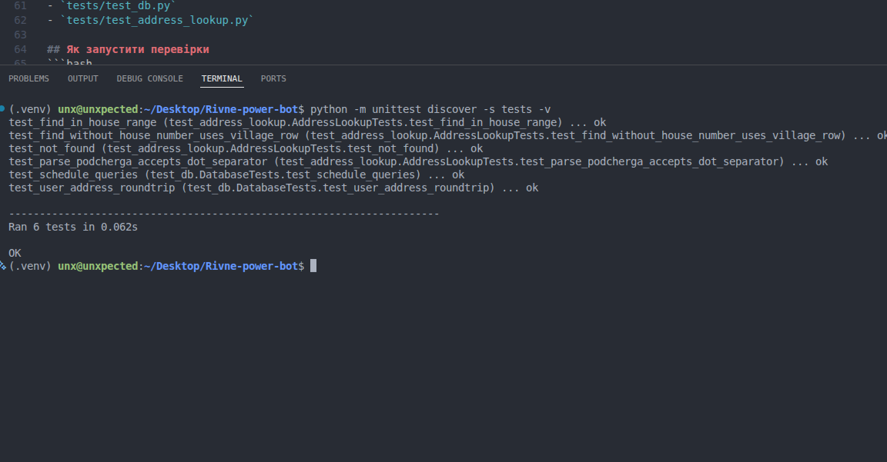

# Практична робота: аналіз і оптимізація коду

## Що це за проєкт
Це Telegram-бот, який допомагає дізнатися чергу відключень світла за адресою в Рівненській області.

## Що було зроблено
У роботі я:
- перевірив код на помилки;
- виправив критичні баги;
- прискорив пошук адрес;
- додав тести;
- перевірив використання ресурсів (CPU/пам'ять);
- оформив результати у звіт.

## 1. Які інструменти використав
- `python -m py_compile` та `python -m compileall` — щоб знайти помилки в коді.
- `unittest` — щоб перевірити, що все працює після змін.
- `cProfile` — щоб знайти повільні частини коду.
- `tracemalloc` — щоб подивитися використання пам'яті.

## 2. Які проблеми знайшов
Головні проблеми, які були в коді:
- неправильні імпорти (через це бот падав);
- помилки у викликах функцій БД;
- невідповідність параметрів функцій;
- неправильна робота пошуку адрес;
- токен бота був захардкоджений у файлі;
- шляхи до файлів залежали від того, з якої папки запускати програму.

## 3. Що оптимізував
- покращив алгоритм пошуку адрес у PDF;
- додав підтримку форматів черги `2,1` і `2.1`;
- прибрав випадкові (невалідні) черги типу `7.8`;
- зробив вибір найкращого збігу, а не першого;
- зменшив зайві обчислення при пошуку.

## 4. Перевірка ресурсів
Профілювання показало:
- найбільше часу займає початкове читання PDF;
- після завантаження пошук працює значно швидше;
- використання пам'яті стабільне для цього обсягу даних.

## 5. Результат профілювання
Після оптимізації пошук став приблизно у **7-8 разів швидший** на серії запитів.

## 6. Тестування
Додані тести:
- `tests/test_db.py` — перевірка запису/читання з БД;
- `tests/test_address_lookup.py` — перевірка пошуку адрес і визначення черги.




Усі тести проходять успішно (`OK`).

## 7. Які файли були змінені
- `config.py`
- `database/db.py`
- `services/scraper.py`
- `services/address_lookup.py`
- `handlers/bot.py`
- `requirements.txt`
- `analysis/perf_profile.py`
- `tests/test_db.py`
- `tests/test_address_lookup.py`

## Як запустити перевірки
```bash
./venv/bin/python -m compileall config.py handlers services database tests analysis
./venv/bin/python -m unittest discover -s tests -v
./venv/bin/python analysis/perf_profile.py
```


## Висновок
Код став стабільнішим, швидшим і зрозумілішим. Бот правильно визначає черги для перевірених адрес (наприклад, `Томахів -> 2.1`, `Київська 81 -> 5.2`).
